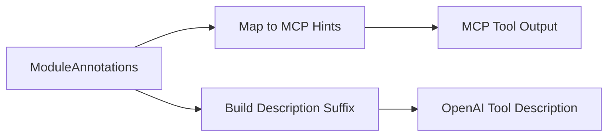

# Annotation Mapper

> Feature spec for code-forge implementation planning.
> Source: extracted from apcore-mcp/docs/tech-design-apcore-mcp.md
> Created: 2026-04-06

## Purpose

The Annotation Mapper bridges apcore's behavioral annotations (e.g., `destructive`, `readonly`, `requires_approval`) into the specific metadata formats expected by the Model Context Protocol (MCP) and OpenAI's tool-use API. It provides critical safety hints to AI agents about how to handle tools.

## Scope

**Included:**
- Mapping `ModuleAnnotations` to MCP `ToolAnnotations` hints (`destructiveHint`, `readOnlyHint`, etc.).
- Generation of a parseable description suffix for OpenAI tool descriptions (since OpenAI tools lack native annotation support).
- Identification of high-consequence operations (e.g., those requiring human-in-the-loop approval).
- Inclusion of `streaming` status in annotations for agent awareness.

**Excluded:**
- Enforcement of these behavioral rules (the `Executor` or `ApprovalHandler` handles enforcement).
- Translation of non-standard, user-defined annotations.

## Core Responsibilities

1. **MCP Mapping** — Maps apcore's boolean annotation fields to their MCP `ToolAnnotations` equivalents.
2. **OpenAI Description Embedding** — Appends structured, machine-readable suffixes to tool descriptions when using the OpenAI adapter.
3. **Safety Warning Generation** — Identifies non-default, high-risk annotations and provides formatted warnings for display in agent interfaces.

## Interfaces

### Inputs
- **ModuleAnnotations** (apcore SDK) — The source metadata from the apcore `ModuleDescriptor`.

### Outputs
- **ToolAnnotations** (MCP SDK) — The protocol-specific hint object for the tool.
- **Annotation Suffix String** (OpenAI Converter) — A formatted string added to the tool description.

### Dependencies
- **apcore-python SDK** — Provides the `ModuleAnnotations` dataclass.
- **MCP Python SDK** — Provides the `ToolAnnotations` type definition.

## Data Flow

## Key Behaviors

### Description Suffix Generation
For OpenAI tool descriptions, a suffix is generated only for non-default values:
1. Safety warnings for `destructive` or `requires_approval` are prioritized.
2. A structured block `[Annotations: readonly=true, idempotent=true]` is appended with non-default fields.
3. Default values (`readonly=false`, `destructive=false`, `idempotent=false`, `requires_approval=false`, `open_world=true`) are omitted to save tokens.

### Approval Check
The mapper identifies modules that require a human-in-the-loop approval step based on the `requires_approval` flag, which can then be used to trigger MCP elicitation or other confirmation flows.

### Decorator Metadata Enrichment
Beyond behavioral annotations, the mapper also projects auxiliary `ModuleDescriptor` metadata sourced from `@module` decorators / YAML bindings into the MCP `Tool` output:

1. **`descriptor.examples`** — Rendered into the MCP `Tool.description` as an `Examples:` section with bullet list. The mapper emits at most three bullets (the first three examples), truncating additional entries to keep descriptions bounded. Each bullet uses the example's short-form summary (or stringified input/output pair) and is appended after the primary description text, separated by a blank line.
2. **`descriptor.tags`** — Mirrored onto the MCP tool as `keywords` (list of strings) and, where applicable, a derived `category` hint for client-side grouping. Tags remain unmodified (no case normalization) to preserve registry semantics.
3. **`descriptor.version`** — Emitted as `_meta.version` on the MCP `Tool` object (MCP `_meta` reserved namespace), allowing clients to surface per-tool version information independent of the server-level version.
4. **`descriptor.documentation_url`** — Emitted as `_meta.documentationUrl` (camelCase per MCP `_meta` conventions) for clients that link out to external tool documentation.

All four fields are optional: when absent or `None` on the descriptor, the mapper omits the corresponding output field entirely rather than emitting empty values. This enrichment is additive and must not conflict with existing description suffix generation used by the OpenAI adapter.

## Constraints

- **Case Consistency**: Output labels in suffixes must follow a consistent, parseable naming convention.
- **Protocol Defaults**: When apcore annotations are `None`, the mapper must revert to the safe defaults specified by the protocol (e.g., `read_only_hint=False`, `open_world_hint=True`).

## Error Handling

- **Missing Annotations**: Handles `None` input gracefully by returning protocol-standard default objects.
- **Schema Drift**: Ignores unknown annotation fields from legacy versions without crashing.

## Notes

- This component is vital for safe AI-agent interactions with real-world tools. Without these hints, an agent might inadvertently perform destructive operations without human oversight.
