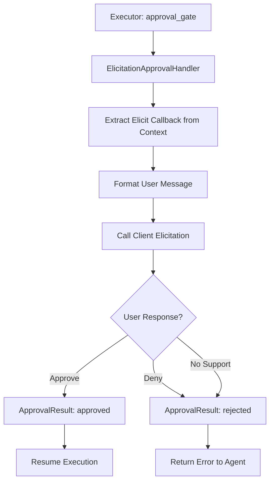

# Approval Handler

> Feature spec for code-forge implementation planning.
> Source: extracted from apcore-mcp/docs/srs-apcore-mcp.md
> Created: 2026-04-06

## Purpose

The Approval Handler implements apcore's "Human-in-the-Loop" safety mechanism by leveraging the Model Context Protocol (MCP) elicitation capability. When a tool call is flagged as requiring approval (e.g., destructive or high-cost operations), the handler interrupts the execution flow and asks the human user for explicit confirmation before proceeding.

## Scope

**Included:**
- `ElicitationApprovalHandler` implementation of the `ApprovalHandler` protocol.
- Integration with the MCP elicitation request (`sampling/createMessage` or tool-specific elicitation).
- Formatting of the approval request (module ID, description, and proposed arguments).
- Mapping of user responses (accept, reject) to `ApprovalResult`.
- Support for CLI flags to configure approval behavior (`elicit`, `auto-approve`, `always-deny`).

**Excluded:**
- Implementation of the `Executor` approval gate (provided by apcore).
- Direct UI interaction (handled by the MCP client, e.g., Claude Desktop).

## Core Responsibilities

1. **Safety Intercept** — Receives the `ApprovalRequest` from the Executor and prepares the protocol-level message for the human user.
2. **Elicitation Bridge** — Calls the MCP elicitation callback (stored in the execution context) and waits asynchronously for the user's response.
3. **Action Mapping** — Translates the user's action (e.g., clicking "Approve" or "Cancel") into the formal `ApprovalResult` (status and optional reason) required by the Executor.
4. **Error Resiliency** — Handles cases where the client does not support elicitation or the user cancels the request by failing the approval safely.

## Interfaces

### Inputs
- **ApprovalRequest** (apcore Executor) — Contains the `module_id`, `description`, and `arguments` of the tool call awaiting approval.

### Outputs
- **ApprovalResult** (apcore Executor) — The decision (`approved` or `rejected`) returned to the pipeline.
- **Elicitation Message** (MCP Client) — A structured request displayed to the user.

### Dependencies
- **apcore-python SDK** — Provides the `ApprovalHandler` protocol and related types.
- **MCP Python SDK** — Provides the elicitation protocol handlers.

## Data Flow

## Key Behaviors

### Structured User Prompt
The handler generates a human-friendly message that includes the tool's purpose and the exact arguments being passed. This ensures the user has full context before granting approval.

### Fail-Safe Rejection
If the MCP client does not support elicitation, if the connection is lost during the request, or if the user simply cancels, the handler defaults to a "Rejected" result. Security is preserved by never assuming implicit approval.

### CLI Configuration
The system supports global approval modes via the `--approval` CLI flag:
- `elicit`: Always ask the user (default for high-security environments).
- `auto-approve`: Automatically grant approval for all modules (development mode).
- `always-deny`: Block all tools that require approval (maximum lockdown).

## Constraints

- **Non-Blocking Loop**: The handler must not block the entire MCP server while waiting for a single user's response; other clients must remain responsive.
- **Timeout Management**: The handler should respect any execution timeouts configured for the tool call.

## Error Handling

- **Elicitation Failure**: If the protocol message cannot be sent, the handler returns a rejected `ApprovalResult` with a "Communication failed" reason.
- **Malformed Response**: If the client returns an unrecognized response, it is treated as a rejection.

## Notes

- This feature is a primary defense against unintended side effects in autonomous agent workflows.
- It leverages the standard `sampling` or `elicitation` features of the MCP protocol to provide a native-feeling UI for the user.
