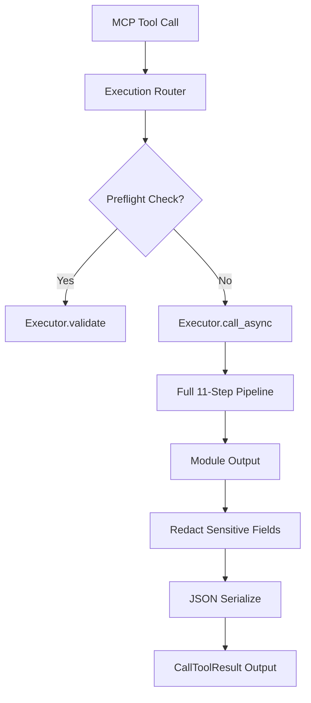

# Execution Router

> Feature spec for code-forge implementation planning.
> Source: extracted from apcore-mcp/docs/tech-design-apcore-mcp.md
> Created: 2026-04-06

## Purpose

The Execution Router is the central dispatcher that receives tool-call requests from the MCP server and routes them through apcore's `Executor` pipeline. It ensures that every tool call from an AI agent is subject to the same rigorous validation, security (ACL), and middleware rules as any other module invocation in the apcore ecosystem.

## Scope

**Included:**
- Routing tool calls by `module_id` with incoming arguments (dict).
- Integration with apcore's `Executor.call_async()` to handle both sync and async modules.
- Serialization of module output (from dicts) into standard JSON strings for MCP `TextContent`.
- Redaction of sensitive fields in tool output before returning to the agent.
- Optional capturing of pipeline traces for observability.
- Pre-execution validation ("Preflight Check") to verify if a tool call would succeed.

**Excluded:**
- Direct module execution (always delegates to `Executor`).
- Protocol-level message handling (handled by the MCP SDK).

## Core Responsibilities

1. **Dispatcher** — Maps the tool name to the appropriate apcore `module_id` and executes it through the full 11-step pipeline.
2. **Output Normalization** — Converts various module output types into a consistent JSON string format using `json.dumps()` with a `default=str` fallback for non-serializable objects.
3. **Data Protection** — Automatically redacts fields marked as sensitive (`x-sensitive: true`) and keys matching `_secret_*` to prevent accidental leak of credentials to AI agents.
4. **Validation Gateway** — Provides a non-destructive preflight validation path (`Executor.validate()`) that checks ACLs and schemas without executing the actual module.

## Interfaces

### Inputs
- **Tool Name** (MCP Client) — The identifier of the tool to be called (maps to `module_id`).
- **Arguments** (MCP Client) — A dictionary of input values conforming to the tool's `input_schema`.

### Outputs
- **CallToolResult** (MCP SDK) — The final result (success with text content or error).
- **PreflightResult** (Internal/Explorer) — A summary of check results (module lookup, ACL, schema validation) without execution.

### Dependencies
- **apcore-python SDK** — Provides the `Executor`, `Context`, and `Registry`.
- **Error Mapper** — Used to transform execution failures into formatted MCP error responses.

## Data Flow



## Key Behaviors

### Full Pipeline Enforcement
The router ensures every call passes through all 11 apcore pipeline steps: context creation, call-chain guard, module lookup, ACL check, approval gate, middleware before, input validation, execution, output validation, middleware after, and final return.

### ExtensionManager Plugin Points
When the server is constructed with an `ExtensionManager` (see `./extension-bridge.md` and `apcore/docs/features/extension-system.md`), the router itself does not register extensions — `ExtensionManager.apply()` runs during factory setup and mutates the underlying `Executor` and `Registry`. Three pipeline steps are the effective observation/mutation sites for extension-driven behavior:

- **Step 2 (module lookup)** — observes the `discoverer` and `module_validator` extension points, wired onto the `Registry` before the router is constructed.
- **Step 5 (middleware before) / Step 10 (middleware after)** — observe user-registered `middleware` extensions layered onto the `Executor`, including the `TracingMiddleware` fed by `span_exporter` extensions. The `acl` and `approval_handler` extensions take effect at Steps 4 and 5 respectively via their dedicated executor slots.

The router's contract with extensions is strictly pass-through: it forwards the current `Context` and arguments into the Executor and never skips pipeline steps, so registered extensions always fire exactly once per tool call.

### Output Redaction
Before the output is sent to the AI agent, the router applies recursive redaction. Any field with `x-sensitive: true` in its schema or any key starting with `_secret_` has its value replaced by `"***REDACTED***"`.

### Async-First Strategy
The router always uses `Executor.call_async()`. This allows the MCP server to remain responsive by offloading synchronous module executions to worker threads via `asyncio.to_thread()` automatically.

## Constraints

- **Thread Safety**: Must handle concurrent tool calls from multiple clients safely.
- **Latency**: The routing layer itself should add minimal overhead (< 5ms) beyond the actual module execution time.
- **Data Integrity**: Must operate on a deep copy of the output if redaction or transformation is required.

## Error Handling

- **Dispatch Failures**: Catches all execution errors (ModuleNotFoundError, ACLDeniedError, etc.) and routes them to the `ErrorMapper` to prevent raw tracebacks from reaching the client.
- **Serialization Failures**: Provides a safe fallback if the module output cannot be converted to JSON.

## Version Hint Negotiation

The Execution Router resolves an optional `version_hint` (semver range) for every tool call and forwards it to `Executor.call(..., version_hint=...)` so that apcore can pin module version resolution. The hint is cross-language and travels on the wire as MCP request metadata.

### Wire Contract
The MCP client carries the hint at `params._meta.apcore.version` (string). Example:
```json
{
  "method": "tools/call",
  "params": {
    "name": "my-module",
    "arguments": { "...": "..." },
    "_meta": { "apcore": { "version": ">=1.2.0" } }
  }
}
```

### Value Format
- Semver range string (e.g., `">=1.0.0"`, `"1.2.x"`, `"^2.0"`).
- Maximum length: 64 characters.
- Allowed charset: `[A-Za-z0-9.\-+_~^>=<* ]`.

### Precedence Order
When multiple sources supply a hint, the router resolves in this order (first match wins):
1. Explicit `extras.version_hint` / `extra.versionHint` — SDK caller-supplied (highest priority).
2. MCP request `_meta.apcore.version` — client-supplied.
3. Module descriptor default `metadata.version_hint` / `metadata.versionHint` (lowest).
4. `None` — no pinning; apcore resolves to the latest matching version.

### Validation
- Values exceeding the length cap or containing characters outside the allowed charset are silently dropped (treated as absent), with a `debug`-level log line for diagnosis.
- Malformed semver ranges are passed through to apcore unchanged; apcore rejects them with the standard `invalid_version_range` error, which is surfaced via the Error Mapper.
- The `_meta` dict is untrusted input from the MCP client; SDKs MUST bound-check and charset-validate before forwarding to the Executor (security note).

### Trace-Mode Caveat
When the request carries `_meta.trace == true`, `version_hint` may be unavailable in some SDKs pending apcore 0.19's `call_with_trace` signature extension. This is a known gap tracked by the Rust SDK TODO (`src/server/router.rs`, see `TODO(apcore>=0.19)`); implementations that cannot forward the hint through the trace path MUST still honor it on the non-trace path.

### Implementation References
- Python: `src/apcore_mcp/server/router.py` (version_hint extraction around the `_meta.apcore.version` branch).
- TypeScript: `src/server/router.ts` (`versionHint` resolution at the extras/`_meta.apcore.version`/descriptor cascade).
- Rust: `src/server/router.rs` (`handle_call` — `version_hint` extraction and `TODO(apcore>=0.19)` streaming-trace gap).

## Cancellation Handling

The Execution Router implements bidirectional cancellation, bridging the MCP `notifications/cancelled` protocol message to apcore's cooperative `CancelToken` model (see apcore cancellation feature). This allows an AI agent to abort an in-flight tool call, and ensures long-running modules stop within the grace period.

### call_id to CancelToken Map
The router maintains a per-server `Dict[call_id, CancelToken]` (guarded by a lock). On tool-call entry, the router:
1. Generates/extracts the MCP `call_id` (from `request.id` or `_meta.progressToken`).
2. Creates a fresh `CancelToken`, inserts it into the map, and attaches it to the `Context` via `Context.create(cancel_token=token)` so apcore's executor propagates it to child calls.
3. On completion (success or failure), removes the entry in a `finally` block to prevent leaks.

### Handling notifications/cancelled
When the Transport Manager receives a `notifications/cancelled` message with `requestId`, it forwards it to `ExecutionRouter.cancel(call_id, reason)`. The router:
1. Looks up the `CancelToken` for that `call_id`.
2. Calls `token.cancel()` — cooperative signal picked up by the module's next `token.check()`.
3. Also calls `executor.cancel(call_id)` (when available on apcore >= 0.19) so the executor can short-circuit timers and middleware.
4. Emits a `mcp.call.cancelled` observability event with the reason.

### ContextVar Propagation
The router sets the active `CancelToken` in a `ContextVar` before awaiting `Executor.call_async()`. This ensures the token is visible across `asyncio.to_thread()` boundaries and nested module invocations without threading it through every call signature.

### Race Cases
- **Before-start**: Cancel arrives before the token is registered. The router stores a tombstone `{call_id: CANCELLED}`; the entry handler sees it, creates an already-cancelled token, and raises `ExecutionCancelledError` immediately without invoking the module.
- **After-complete**: Cancel arrives after the entry is removed. The router treats it as a no-op and logs at `debug`.
- **Concurrent cancel**: `CancelToken.cancel()` is idempotent and thread-safe; duplicate notifications are absorbed.

### Error Mapping
`ExecutionCancelledError` raised inside the pipeline is caught by the router and forwarded to the Error Mapper, which emits an MCP error response with code `EXECUTION_CANCELLED` (mapped to JSON-RPC error `-32800` "Request cancelled" per MCP spec). The `CallToolResult` is **not** returned on cancellation; the MCP SDK discards the response for the cancelled `requestId`.

## Notes

- This component is the primary security boundary between the untrusted AI agent and the internal apcore module environment.
- It leverages the `ContextVar` system to preserve identity and tracing across async boundaries.
