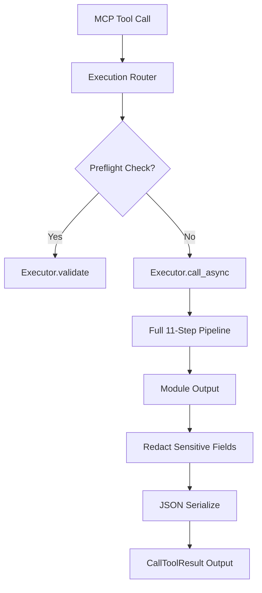

# Execution Router

> Feature spec for code-forge implementation planning.
> Source: extracted from apcore-mcp/docs/tech-design-apcore-mcp.md
> Created: 2026-04-06

## Purpose

The Execution Router is the central dispatcher that receives tool-call requests from the MCP server and routes them through apcore's `Executor` pipeline. It ensures that every tool call from an AI agent is subject to the same rigorous validation, security (ACL), and middleware rules as any other module invocation in the apcore ecosystem.

## Scope

**Included:**
- Routing tool calls by `module_id` with incoming arguments (dict).
- Integration with apcore's `Executor.call_async()` to handle both sync and async modules.
- Serialization of module output (from dicts) into standard JSON strings for MCP `TextContent`.
- Redaction of sensitive fields in tool output before returning to the agent.
- Optional capturing of pipeline traces for observability.
- Pre-execution validation ("Preflight Check") to verify if a tool call would succeed.

**Excluded:**
- Direct module execution (always delegates to `Executor`).
- Protocol-level message handling (handled by the MCP SDK).

## Core Responsibilities

1. **Dispatcher** — Maps the tool name to the appropriate apcore `module_id` and executes it through the full 11-step pipeline.
2. **Output Normalization** — Converts various module output types into a consistent JSON string format using `json.dumps()` with a `default=str` fallback for non-serializable objects.
3. **Data Protection** — Automatically redacts fields marked as sensitive (`x-sensitive: true`) and keys matching `_secret_*` to prevent accidental leak of credentials to AI agents.
4. **Validation Gateway** — Provides a non-destructive preflight validation path (`Executor.validate()`) that checks ACLs and schemas without executing the actual module.

## Interfaces

### Inputs
- **Tool Name** (MCP Client) — The identifier of the tool to be called (maps to `module_id`).
- **Arguments** (MCP Client) — A dictionary of input values conforming to the tool's `input_schema`.

### Outputs
- **CallToolResult** (MCP SDK) — The final result (success with text content or error).
- **PreflightResult** (Internal/Explorer) — A summary of check results (module lookup, ACL, schema validation) without execution.

### Dependencies
- **apcore-python SDK** — Provides the `Executor`, `Context`, and `Registry`.
- **Error Mapper** — Used to transform execution failures into formatted MCP error responses.

## Data Flow

## Key Behaviors

### Full Pipeline Enforcement
The router ensures every call passes through all 11 apcore pipeline steps: context creation, call-chain guard, module lookup, ACL check, approval gate, middleware before, input validation, execution, output validation, middleware after, and final return.

### Output Redaction
Before the output is sent to the AI agent, the router applies recursive redaction. Any field with `x-sensitive: true` in its schema or any key starting with `_secret_` has its value replaced by `"***REDACTED***"`.

### Async-First Strategy
The router always uses `Executor.call_async()`. This allows the MCP server to remain responsive by offloading synchronous module executions to worker threads via `asyncio.to_thread()` automatically.

## Constraints

- **Thread Safety**: Must handle concurrent tool calls from multiple clients safely.
- **Latency**: The routing layer itself should add minimal overhead (< 5ms) beyond the actual module execution time.
- **Data Integrity**: Must operate on a deep copy of the output if redaction or transformation is required.

## Error Handling

- **Dispatch Failures**: Catches all execution errors (ModuleNotFoundError, ACLDeniedError, etc.) and routes them to the `ErrorMapper` to prevent raw tracebacks from reaching the client.
- **Serialization Failures**: Provides a safe fallback if the module output cannot be converted to JSON.

## Notes

- This component is the primary security boundary between the untrusted AI agent and the internal apcore module environment.
- It leverages the `ContextVar` system to preserve identity and tracing across async boundaries.
