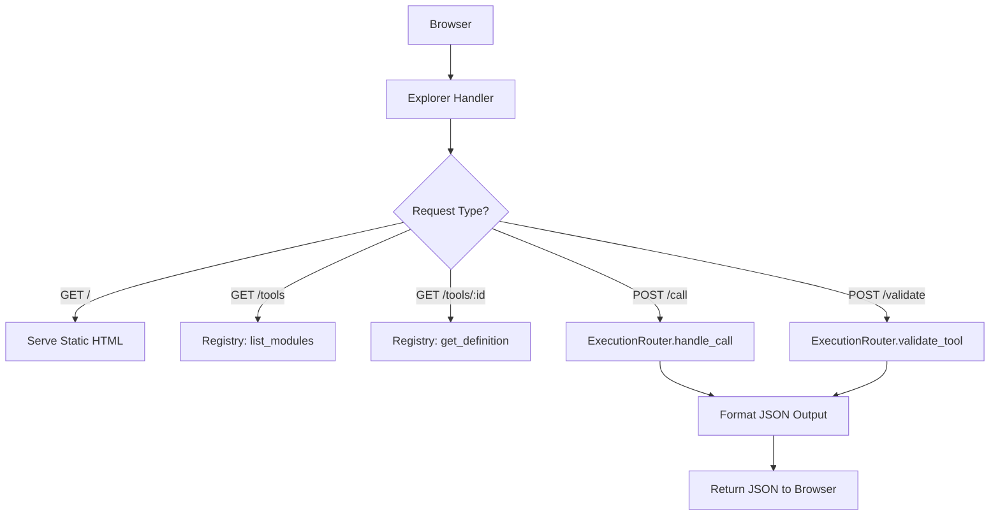

# Explorer UI

> Feature spec for code-forge implementation planning.
> Source: extracted from apcore-mcp/docs/srs-apcore-mcp.md
> Created: 2026-04-06

## Purpose

The Explorer UI is an optional, web-based tool dashboard for developers. It allows for browsing, inspecting, and testing apcore-mcp tools directly from a browser. This provides a user-friendly interface for verifying tool configurations, schemas, and behaviors without needing a full MCP client (like Claude Desktop) during development.

## Scope

**Included:**
- Self-contained HTML/JS page with zero external dependencies.
- Navigation for browsing the registry's registered tools.
- Detailed view of tool metadata (description, annotations, schemas).
- Interactive tool invocation form (when `allow_execute=True`).
- Preflight validation view for testing arguments without execution.
- Integration with the `TransportManager` to mount web routes.

**Excluded:**
- Implementation for `stdio` transport (requires HTTP-based transports).
- Advanced data visualization (text-based JSON input/output only).
- Multi-user authentication within the UI (inherits server-level auth if present).

## Core Responsibilities

1. **Dashboard Hosting** — Serves the static assets (HTML, CSS, JS) for the explorer interface at a configurable URL (default `/explorer`).
2. **Registry Inspector** — Connects the web UI to the internal `Registry` to provide an up-to-date list of available tools.
3. **Execution Simulator** — Provides a controlled environment for calling tool endpoints (`POST /explorer/tools/<name>/call`) and displaying the formatted results.
4. **Validation Helper** — Leverages the `ExecutionRouter`'s preflight check to provide real-time schema validation for inputs.

## Interfaces

### Inputs
- **HTTP Request** (Browser) — Standard GET/POST requests to the `/explorer` endpoints.
- **Tool Input JSON** (User) — The data entered into the interactive execution form.

### Outputs
- **HTML UI Page** (Browser) — The rendered dashboard view.
- **Execution Results JSON** (User) — The formatted output from a tool call or validation check.

### Dependencies
- **Starlette / FastAPI** — Used to mount the explorer routes onto the MCP server application.
- **MCPServerFactory** — Used to obtain tool metadata for the UI.

## Data Flow

## Key Behaviors

### Zero-Dependency Design
The Explorer UI is a single, self-contained HTML file with inline CSS and JavaScript. It does not use external CDNs or npm packages. This ensures it works in "air-gapped" or offline development environments and can be easily shared across Python, TypeScript, and Rust implementations.

### Interactive Sandbox
When `allow_execute` is enabled, the UI generates a dynamic form based on the tool's `input_schema`. Users can enter values and see the actual JSON response, making it the primary tool for debugging module logic.

### Safety Guards
The explorer respects the server's global configuration. If authentication is required or if `allow_execute` is false, the UI reflects these restrictions and prevents unauthorized execution.

## Constraints

- **Single Asset**: All UI code must live in one file to simplify embedding in the `apcore_mcp` package.
- **Protocol Neutrality**: The UI communicates over standard HTTP/JSON, not the MCP protocol itself, to avoid client-side MCP library dependencies.
- **URL Pathing**: All relative links within the UI must be relative to the `explorer_prefix` to support hosting behind reverse proxies.

## Error Handling

- **Tool Not Found**: Returns `404 Not Found` with a JSON error body if the user requests a non-existent tool.
- **Validation Failure**: Displays field-level error messages directly in the UI during the "Preflight" stage.

## Notes

- This feature is inspired by tools like Swagger/OpenAPI UI but specialized for the apcore-mcp environment.
- It is enabled by default in development mode but should be disabled (or authenticated) in production environments.
