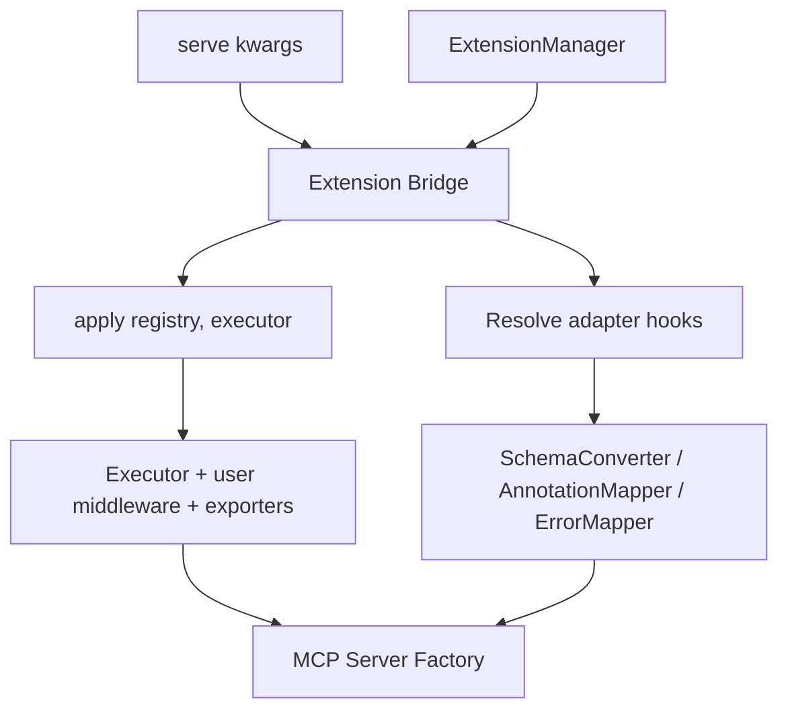

# Extension Bridge

> Feature spec for code-forge implementation planning.
> Source: extracted from apcore-mcp/docs/tech-design-apcore-mcp.md (F-042)
> Created: 2026-04-15

## Purpose

The Extension Bridge is the integration seam between apcore's `ExtensionManager` and the MCP server pipeline. It owns the wiring that turns caller-supplied extensions — ACLs, approval handlers, module validators, discoverers, span exporters, middleware, and MCP-specific adapter hooks — into a fully configured `Executor` and `MCPServerFactory`. It centralizes resolution precedence, load order, and type-safety guarantees so that individual features (Server Factory, Execution Router, Transport Manager) never need to know about `ExtensionManager` directly.

## Scope

**Included:**
- Accepting an `ExtensionManager | None` from `serve()` and routing it into the factory.
- Invoking `ExtensionManager.apply(registry, executor)` at the correct point in factory startup.
- Resolving MCP-specific adapter hooks (`schema_converter`, `annotation_mapper`, `error_mapper`) using a documented precedence.
- Enforcing load order: extensions before built-in MCP middleware.
- Validating extension types at registration time (delegated to apcore's `ExtensionManager`).

**Excluded:**
- Defining new apcore extension points (owned by apcore's Extension System).
- Runtime mutation of extensions after server startup (not supported; restart required).
- Transport-layer extensions (reserved for future Transport Manager extension points).

## Core Responsibilities

1. **Wiring** — Calls `ExtensionManager.apply(registry, executor)` before the factory installs its built-in middleware, so extensions observe a clean Executor baseline.
2. **Adapter Hook Resolution** — Picks the effective `SchemaConverter`, `AnnotationMapper`, and `ErrorMapper` from explicit `serve()` kwargs, `ExtensionManager` registrations, or built-in defaults — in that order.
3. **Load-Order Enforcement** — Guarantees that user middleware runs outside the built-in middleware stack, so apcore-mcp's safety-critical adapters (tracing, redaction, preflight) always sit closest to module execution.
4. **Type Gatekeeping** — Relies on `ExtensionManager.register()` type checks for built-in extension points and performs an additional isinstance/duck-type guard on the three MCP-specific hooks before binding them to the factory.

## Interfaces

### Inputs
- **ExtensionManager** (apcore SDK, optional) — Pre-populated with extensions the caller wants applied.
- **Adapter kwargs** (`serve()`) — Optional `schema_converter`, `annotation_mapper`, `error_mapper` overrides.
- **Registry / Executor** — Targets that `apply()` mutates.

### Outputs
- **Configured Executor** — Carries user-supplied ACL, approval handler, validators, discoverer, middleware, and span exporters, with built-in middleware layered on top.
- **Resolved adapter triple** — `(SchemaConverter, AnnotationMapper, ErrorMapper)` bound to the factory.

### Dependencies
- **apcore ExtensionManager** — Performs the actual wiring onto `Registry` and `Executor`.
- **MCP Server Factory** — Consumes the resolved adapters and configured Executor.
- **Execution Router** — Inherits the configured Executor through the factory.

## Data Flow

## Key Behaviors

### Resolution Precedence
For each of the three MCP-specific adapters, the bridge selects an instance using the first source that yields a non-null value:

1. Explicit `serve()` kwarg (`schema_converter=...`, `annotation_mapper=...`, `error_mapper=...`).
2. `ExtensionManager.get("mcp_schema_converter" | "mcp_annotation_mapper" | "mcp_error_mapper")`.
3. Built-in default constructed by the factory.

A WARNING is logged when sources (1) and (2) are both present and non-equal, indicating caller ambiguity.

### Load Order
The bridge enforces the sequence documented in `./mcp-server-factory.md` (Extension Integration → Load Order):

1. `ExtensionManager.apply(registry, executor)`.
2. Built-in MCP middleware installation.
3. Adapter hook binding.
4. Protocol handler registration.

This sequence is load-bearing: step (1) must precede step (2) so that user middleware wraps the Executor from the outside, while built-in middleware (tracing, redaction, preflight) stays closest to the module boundary.

### Executor Passed In Explicitly
When `serve()` is invoked with an `Executor` rather than a `Registry`, the bridge still calls `ExtensionManager.apply()` on it. Callers who have already wired extensions SHOULD pass the same `ExtensionManager` to avoid double-application. Single-cardinality points are idempotent under re-application, but multi-cardinality points (`middleware`, `span_exporter`) accumulate — duplicate calls will install duplicate middleware.

### Absent ExtensionManager
When `extensions=None`, the bridge is a no-op for the `apply()` step: the factory builds the default Executor, installs its built-in middleware, and resolves adapters from kwargs or defaults only. This is the canonical path for zero-config usage.

## Constraints

- **Startup-Only**: Wiring happens exactly once, before the MCP Server begins accepting connections. Hot-swapping extensions is out of scope.
- **Type Safety**: Adapter hooks MUST satisfy their protocol; a `TypeError` is raised before any server socket is opened.
- **No Silent Drops**: Every registered extension MUST reach the Executor or Registry; if the bridge cannot wire an extension, it raises rather than proceeding.

## Error Handling

- **Type Mismatch**: Propagates `TypeError` from `ExtensionManager.register()` and from adapter-hook isinstance checks.
- **Duplicate Apply Warning**: Logs WARNING when the same `ExtensionManager` appears to have been applied to a caller-supplied Executor and is re-applied by the bridge (detected via an internal `_applied` sentinel set on the manager).
- **Ambiguous Adapter Source**: Logs WARNING (not error) when both a kwarg and an `ExtensionManager` registration supply the same hook; the kwarg wins.

## Notes

- This component is the single point of truth for "how extensions reach the MCP server." Server Factory, Execution Router, and Transport Manager all treat the resulting Executor/adapters as opaque, pre-configured inputs.
- The bridge is intentionally thin — it orchestrates existing apcore primitives rather than introducing parallel plugin machinery.
- Language parity: Python, TypeScript, and Rust SDKs implement identical precedence and load-order rules; only the type-check mechanism differs (isinstance / duck-type guard / trait bound).
