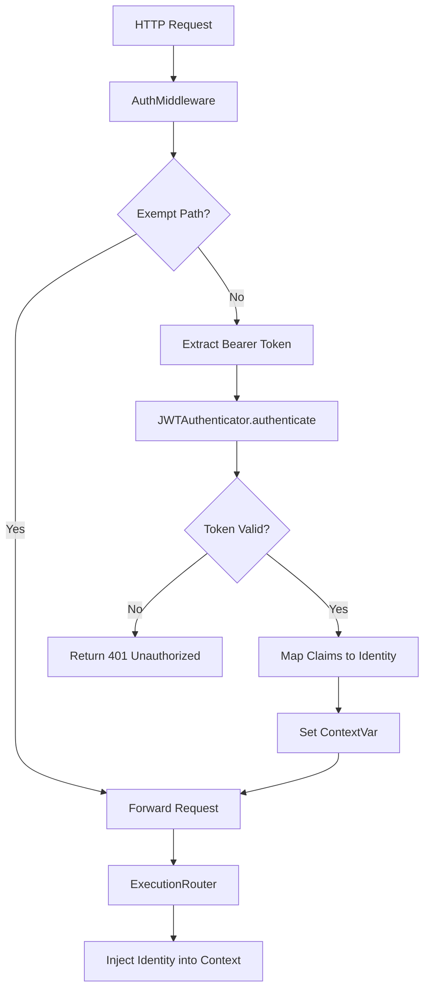

# JWT Authenticator

> Feature spec for code-forge implementation planning.
> Source: extracted from apcore-mcp/docs/srs-apcore-mcp.md
> Created: 2026-04-06

## Purpose

The JWT Authenticator provides a pluggable security layer for HTTP-based MCP transports. It validates incoming JWT (JSON Web Token) bearer tokens, extracts user identity and roles, and injects them into the apcore execution context. This enables fine-grained Access Control (ACL) for tools exposed over the network.

## Scope

**Included:**
- `Authenticator` protocol definition for pluggable backends.
- `JWTAuthenticator` implementation for validating RS256/HS256 tokens.
- `AuthMiddleware` (ASGI) for intercepting HTTP requests and verifying headers.
- Claim mapping (e.g., mapping `sub` to `identity.id`).
- Integration with the apcore `Identity` and `Context` system.
- Support for permissive mode (optional auth) and exempt paths (e.g., `/health`).

**Excluded:**
- JWT issuance or "Login" flows (token must be provided by the client).
- Management of public keys or secrets (provided via configuration).
- Authentication for `stdio` transport (which is inherently secure via local process pipes).

## Core Responsibilities

1. **Token Validator** — Decodes and verifies the signature, expiration (`exp`), audience (`aud`), and issuer (`iss`) of incoming JWTs.
2. **Identity Mapper** — Translates JWT claims into the structured `Identity` object (id, type, roles, attributes) used by apcore's ACL system.
3. **Request Guard** — Intercepts all incoming HTTP/SSE requests and returns `401 Unauthorized` if a valid token is missing (when required).
4. **Context Bridge** — Uses `ContextVar` to securely pass the authenticated identity from the HTTP middleware to the tool execution handler.

## Interfaces

### Inputs
- **Authorization Header** (HTTP Client) — The `Bearer <token>` string from the request headers.
- **Verification Key** (Configuration) — The secret or public key used to verify signatures.

### Outputs
- **Identity Object** (apcore Executor) — A populated `Identity` instance attached to the execution context.
- **401 Unauthorized** (HTTP Client) — Error response when authentication fails.

### Dependencies
- **PyJWT / jose** — Low-level library for JWT decoding and validation.
- **apcore-python SDK** — Provides the `Identity` and `Context` classes.

## Data Flow

## Key Behaviors

### Claim Mapping
The authenticator supports a `claim_mapping` configuration that defines which JWT claims correspond to identity fields. By default, `sub` maps to `id`, `roles` to `roles`, and `type` to `type`.

### Permissive Mode
If `require_auth=False` is configured, the middleware will attempt to authenticate but will allow the request to proceed even if no token is provided. In this case, the tool will execute with an `Anonymous` identity, and the Executor's ACL will decide if the call is permitted.

### Stdio Immunity
Authentication is automatically bypassed when using the `stdio` transport, as that transport is only accessible to the local process that launched the server (e.g., the user's IDE or desktop client).

## Constraints

- **Algorithm Whitelist**: Must explicitly configure allowed algorithms (e.g., `["RS256"]`) to prevent algorithm-switching attacks.
- **Header Format**: Must strictly enforce the `Bearer ` prefix (case-insensitive) in the `Authorization` header.
- **Clock Skew**: Should allow a small configurable leeway (e.g., 30s) for clock synchronization issues during expiration checks.

## Error Handling

- **Expired Token**: Returns 401 with `WWW-Authenticate: Bearer error="invalid_token", error_description="The token is expired"`.
- **Invalid Signature**: Returns 401 with generic "Invalid token" message to avoid leaking details about the key.
- **Missing Claims**: If a required claim (like `sub`) is missing, authentication fails.

## Notes

- This feature is essential for "Tool-as-a-Service" deployments where the MCP server is hosted on a remote server.
- It ensures that apcore's powerful ACL system is effective even when tools are called over the public internet.
