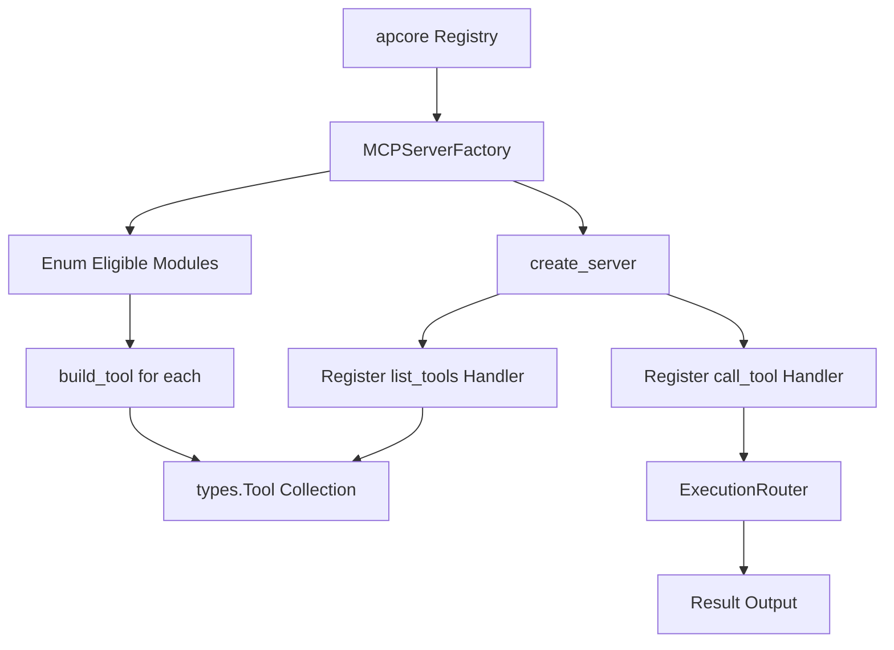

# MCP Server Factory

> Feature spec for code-forge implementation planning.
> Source: extracted from apcore-mcp/docs/tech-design-apcore-mcp.md
> Created: 2026-04-06

## Purpose

The MCP Server Factory is the primary builder that constructs an MCP protocol server instance from an apcore Registry. It handles the mapping of apcore modules to MCP tools, configures protocol-level handlers (e.g., `list_tools`, `call_tool`), and ensures the server is ready to accept transport connections.

## Scope

**Included:**
- Construction of a low-level MCP `Server` instance with defined name and version.
- Transformation of `ModuleDescriptor` metadata into MCP `Tool` objects.
- Registration of core protocol handlers for tool discovery and execution.
- Filtering of tools based on tags or prefixes during construction.
- Integration with the `SchemaConverter` and `AnnotationMapper`.

**Excluded:**
- Selection of the transport layer (handled by `TransportManager`).
- Lifecycle management (handled by `serve()` or the `MCPServer` wrapper).

## Core Responsibilities

1. **Tool Builder** — Iterates over all discovered modules in the registry and generates an MCP-compliant `Tool` object for each.
2. **Schema Inlining** — Leverages the `SchemaConverter` to ensure all tool schemas are self-contained and protocol-compliant.
3. **Annotation Synthesis** — Leverages the `AnnotationMapper` to attach protocol-level behavioral hints to each tool.
4. **Handler Registration** — Defines and registers the `@server.list_tools()` and `@server.call_tool()` callbacks that connect the MCP protocol to internal apcore logic.

## Interfaces

### Inputs
- **Registry** (apcore SDK) — The source of module discovery and metadata.
- **Server Name/Version** (Public API) — Identity metadata for the MCP server.
- **Filters** (Public API) — Optional tag and prefix filters for tool selection.

### Outputs
- **MCP Server Instance** (MCP SDK) — A fully configured, low-level server object ready for transport binding.
- **Tool List** (MCP SDK) — A collection of `Tool` objects used for tool discovery.

### Dependencies
- **MCP Python SDK** — Provides the `Server`, `Tool`, and `CallToolResult` types.
- **Execution Router** — Used by the tool-call handler to dispatch module execution.

## Data Flow

## Key Behaviors

### Dynamic Tool Construction
The factory constructs `Tool` objects on-demand from the registry. If the registry is updated at runtime (via the `RegistryListener`), the factory can rebuild the tool list without restarting the server.

### Robust Building
If building a tool for one module fails (e.g., due to a malformed schema), the factory logs a warning and continues building tools for the remaining modules rather than crashing the entire server.

### Identity Reporting
The factory ensures that the server correctly identifies itself to clients with a configurable name and version (e.g., `apcore-mcp v1.0.0`).

## Constraints

- **Name Constraint**: The server name must be non-empty and must not exceed 255 characters.
- **Protocol Limits**: Tool names are derived from `module_id` and must comply with the protocol's naming restrictions.
- **Bijective Mapping**: Each module in the registry (post-filtering) results in exactly one tool in the MCP interface.

## Error Handling

- **Registry Empty**: If no modules are found, the factory logs a warning and produces an empty tool list rather than an error.
- **Duplicate Registration**: Idempotently handles registration of tool handlers to prevent multiple definitions.

## Notes

- This component is the bridge that converts the "idea" of a module in apcore into the "reality" of a tool in the MCP protocol.
- It is designed to be language-agnostic in its logic, enabling identical behavior across Python, TypeScript, and Rust implementations.
