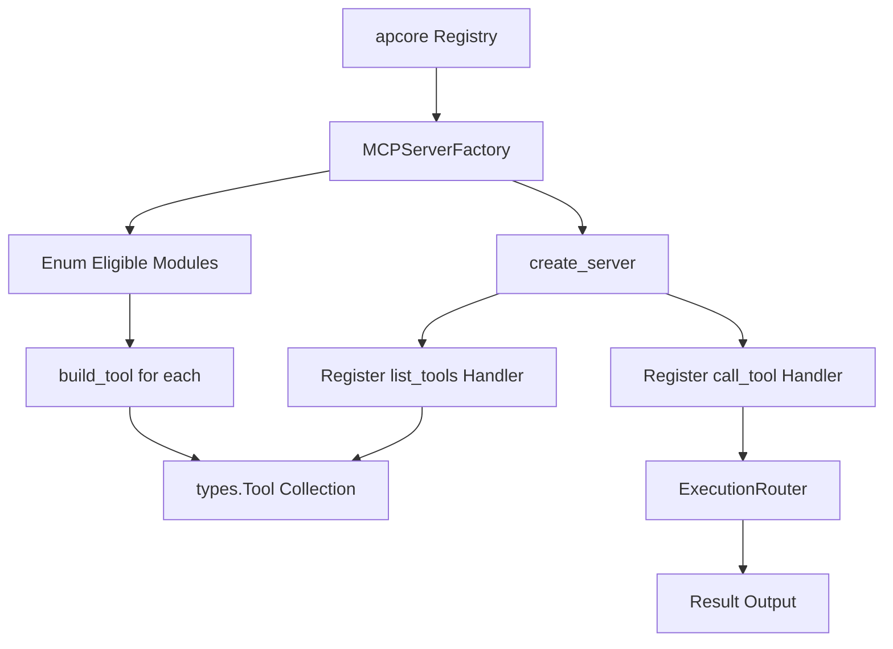

# MCP Server Factory

> Feature spec for code-forge implementation planning.
> Source: extracted from apcore-mcp/docs/tech-design-apcore-mcp.md
> Created: 2026-04-06

## Purpose

The MCP Server Factory is the primary builder that constructs an MCP protocol server instance from an apcore Registry. It handles the mapping of apcore modules to MCP tools, configures protocol-level handlers (e.g., `list_tools`, `call_tool`), and ensures the server is ready to accept transport connections.

## Scope

**Included:**
- Construction of a low-level MCP `Server` instance with defined name and version.
- Transformation of `ModuleDescriptor` metadata into MCP `Tool` objects.
- Registration of core protocol handlers for tool discovery and execution.
- Filtering of tools based on tags or prefixes during construction.
- Integration with the `SchemaConverter` and `AnnotationMapper`.

**Excluded:**
- Selection of the transport layer (handled by `TransportManager`).
- Lifecycle management (handled by `serve()` or the `MCPServer` wrapper).

## Core Responsibilities

1. **Tool Builder** — Iterates over all discovered modules in the registry and generates an MCP-compliant `Tool` object for each.
2. **Schema Inlining** — Leverages the `SchemaConverter` to ensure all tool schemas are self-contained and protocol-compliant.
3. **Annotation Synthesis** — Leverages the `AnnotationMapper` to attach protocol-level behavioral hints to each tool.
4. **Handler Registration** — Defines and registers the `@server.list_tools()` and `@server.call_tool()` callbacks that connect the MCP protocol to internal apcore logic.

## Interfaces

### Inputs
- **Registry** (apcore SDK) — The source of module discovery and metadata.
- **Server Name/Version** (Public API) — Identity metadata for the MCP server.
- **Filters** (Public API) — Optional tag and prefix filters for tool selection.

### Outputs
- **MCP Server Instance** (MCP SDK) — A fully configured, low-level server object ready for transport binding.
- **Tool List** (MCP SDK) — A collection of `Tool` objects used for tool discovery.

### Dependencies
- **MCP Python SDK** — Provides the `Server`, `Tool`, and `CallToolResult` types.
- **Execution Router** — Used by the tool-call handler to dispatch module execution.

## Data Flow



## Key Behaviors

### Dynamic Tool Construction
The factory constructs `Tool` objects on-demand from the registry. If the registry is updated at runtime (via the `RegistryListener`), the factory can rebuild the tool list without restarting the server.

### Robust Building
If building a tool for one module fails (e.g., due to a malformed schema), the factory logs a warning and continues building tools for the remaining modules rather than crashing the entire server.

### Identity Reporting
The factory ensures that the server correctly identifies itself to clients with a configurable name and version (e.g., `apcore-mcp v1.0.0`).

### Custom Middleware Injection
The public `serve()` entry point accepts an optional user-supplied middleware list:

```python
def serve(
    registry: Registry,
    *,
    name: str = "apcore-mcp",
    version: str = "...",
    transport: str = "stdio",
    middlewares: list[Middleware] | None = None,
    # ... existing parameters
) -> None: ...
```

When `middlewares` is provided, the factory passes the list through to the `ExecutionRouter` (and the underlying apcore `Executor`), which installs them after all built-in middlewares registered by the factory (e.g., logging, tracing, approval enforcement, redaction). This ordering guarantee — **built-ins first, user middlewares after** — ensures user hooks observe already-redacted inputs and participate in error recovery without subverting safety-critical layers. When `middlewares` is `None` or empty, behavior is unchanged. Each entry must be an `apcore.middleware.Middleware` instance; passing non-`Middleware` values raises a configuration error before the server starts.

### Strict Schema Sourcing
When building MCP tools, the factory prefers `Registry.exportSchema(moduleId, strict=true)` if the registry exposes it, using the registry-provided strict schema directly as the MCP `inputSchema`. If the call fails or the registry does not implement `exportSchema`, the factory falls back to local strict post-processing via the Schema Converter (see `docs/features/schema-converter.md`, "Strict Mode for MCP"). Both upstream behaviors yield identical strict output — the registry path is preferred because it avoids a redundant walk.

## Constraints

- **Name Constraint**: The server name must be non-empty and must not exceed 255 characters.
- **Protocol Limits**: Tool names are derived from `module_id` and must comply with the protocol's naming restrictions.
- **Bijective Mapping**: Each module in the registry (post-filtering) results in exactly one tool in the MCP interface.

## Error Handling

- **Registry Empty**: If no modules are found, the factory logs a warning and produces an empty tool list rather than an error.
- **Duplicate Registration**: Idempotently handles registration of tool handlers to prevent multiple definitions.

## Extension Integration

The factory integrates with apcore's `ExtensionManager` (see `apcore/docs/features/extension-system.md`) so applications can customize protocol-level behavior without forking the factory. This integration is mediated by the Extension Bridge (see `./extension-bridge.md`), which translates MCP-specific plugin points into apcore extension-point registrations and owns load-order policy.

### `serve()` Signature Extension
The top-level `serve()` entry point accepts an optional `extensions` parameter and forwards it to the factory:

```python
def serve(
    registry,
    *,
    extensions: "ExtensionManager | None" = None,
    schema_converter: "SchemaConverter | None" = None,
    annotation_mapper: "AnnotationMapper | None" = None,
    error_mapper: "ErrorMapper | None" = None,
    ...
) -> None: ...
```

When `extensions` is provided, the factory invokes `extensions.apply(registry, executor)` before constructing the MCP server, so the Executor it wraps already carries caller-supplied ACLs, approval handlers, module validators, discoverers, span exporters, and middleware.

### Pass-Through to Executor
If `serve()` receives a bare `Registry` (not an `Executor`), the factory builds the default `Executor(registry, strategy=strategy)` and then calls `ExtensionManager.apply(registry, executor)`. If `serve()` receives an `Executor` directly, the factory still invokes `apply()` on it; callers who have already wired extensions SHOULD pass the same `ExtensionManager` to avoid double-application. Duplicate wiring is idempotent for single-cardinality points but additive for multi-cardinality points (middleware, span exporters).

### Custom Adapter Hooks
In addition to apcore's built-in extension points, the factory exposes three MCP-specific hooks:

| Hook | Replaces | Expected type |
|------|----------|---------------|
| `schema_converter` | Default `SchemaConverter` | `SchemaConverter` protocol |
| `annotation_mapper` | Default `AnnotationMapper` | `AnnotationMapper` protocol |
| `error_mapper` | Default `ErrorMapper` | `ErrorMapper` protocol |

These may be supplied directly to `serve()` as keyword arguments or registered on the `ExtensionManager` under the MCP-reserved extension points `mcp_schema_converter`, `mcp_annotation_mapper`, and `mcp_error_mapper` (all single-cardinality). The Extension Bridge resolves the effective instance using the precedence: explicit kwarg > `ExtensionManager` registration > built-in default.

### Load Order
The factory applies customizations in a strict order so extensions observe a stable baseline:

1. `ExtensionManager.apply(registry, executor)` wires user-supplied discoverers, validators, ACLs, approval handlers, span exporters, and user middleware onto the Executor **first** — extensions run before any built-in MCP middleware is layered on.
2. The factory then installs its **built-in middleware** (tracing, redaction, preflight adapters) so built-ins run closest to the module boundary and cannot be shadowed by extensions.
3. MCP-specific adapter hooks (`schema_converter`, `annotation_mapper`, `error_mapper`) are resolved and bound to the factory instance.
4. Protocol handlers (`list_tools`, `call_tool`) are registered on the MCP Server, wrapping the now-configured Executor.

This ordering guarantees that extensions can observe every tool call but cannot bypass apcore-mcp's core security and observability invariants.

## Notes

- This component is the bridge that converts the "idea" of a module in apcore into the "reality" of a tool in the MCP protocol.
- It is designed to be language-agnostic in its logic, enabling identical behavior across Python, TypeScript, and Rust implementations.
