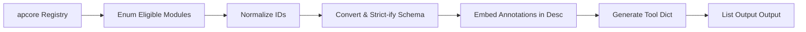

# OpenAI Converter

> Feature spec for code-forge implementation planning.
> Source: extracted from apcore-mcp/docs/tech-design-apcore-mcp.md
> Created: 2026-04-06

## Purpose

The OpenAI Converter transforms apcore modules into OpenAI-compatible tool definitions. It allows any apcore module to be used directly with OpenAI's `chat.completions` API as a function-calling tool. This enables a unified "develop once, use everywhere" approach across both MCP and OpenAI ecosystems.

## Scope

**Included:**
- Conversion of `ModuleDescriptor` to `ChatCompletionTool` dict format.
- Module ID normalization (e.g., converting dots `.` to hyphens `-`).
- Support for OpenAI "Strict Mode" schema transformations.
- Optional embedding of apcore annotations into tool descriptions.
- Filtering of tools based on tags or prefixes during conversion.
- Zero-dependency execution (produces plain dictionaries).

**Excluded:**
- Implementation of the OpenAI API client.
- Handling of tool-call results (managed by the calling application).

## Core Responsibilities

1. **Schema Adapter** — Converts Pydantic-generated schemas into the specific format expected by OpenAI (using the `SchemaConverter`).
2. **Strict Mode Transformer** — If enabled, modifies the JSON Schema to comply with OpenAI's strict requirements (no `additionalProperties`, all fields required/nullable, no defaults).
3. **ID Normalizer** — Replaces dot notation (e.g., `image.resize`) with hyphens (e.g., `image-resize`) to meet OpenAI's character constraints.
4. **Description Enhancer** — Appends metadata about tool behaviors (like `destructive`) to the human-readable description string to inform the model.

## Interfaces

### Inputs
- **Registry / Executor** (apcore SDK) — Source for module discovery and metadata.
- **Strict Mode Toggle** (Boolean) — Whether to apply OpenAI's strict schema rules.
- **Embed Annotations Toggle** (Boolean) — Whether to append behavioral metadata to descriptions.

### Outputs
- **List[Dict[str, Any]]** (OpenAI API) — A list of dictionaries ready to be passed to the OpenAI SDK.

### Dependencies
- **Schema Converter** — Used to resolve and inline schema references.
- **Annotation Mapper** — Used to generate the description suffix.

## Data Flow

## Key Behaviors

### Strict Mode Schema Transformation
When `strict=True`, the converter performs recursive transformation:
- Set `additionalProperties: False`.
- Move all property names to the `required` array.
- Convert any property that wasn't originally required into a union type `[type, "null"]`.
- Strip all `default` values and non-standard `x-*` keys.

### Module ID Normalization
Since OpenAI function names can only contain `[a-zA-Z0-9_-]`, dots are replaced with hyphens. The converter must ensure this mapping is bijective and reversible to allow the calling application to map the tool call back to the original `module_id`.

### Zero-Dependency Output
The converter must return only standard Python types (dict, list, str, etc.) and should NOT import the `openai` package. This ensures maximum compatibility and avoids version conflicts in the host application.

## Constraints

- **Name Length**: OpenAI function names must be under 64 characters.
- **JSON Schema Version**: OpenAI supports a specific subset of JSON Schema; the converter must avoid incompatible features (like `format` in strict mode).
- **Token Efficiency**: The converter should omit redundant information (like default values or empty description suffixes) to minimize token consumption.

## Error Handling

- **Incompatible Schema**: If a schema cannot be converted to OpenAI's strict format (e.g., it uses unsupported keywords), the converter logs a warning and provides the best possible non-strict alternative.
- **ID Conflict**: If normalization results in name collisions (e.g., `a.b` and `a-b` both become `a-b`), the converter raises a `ValueError`.

## Notes

- This component is a pure-function utility that can be used independently of the MCP server.
- It enables legacy OpenAI-based agents to leverage the same tool library as modern MCP-based agents.
