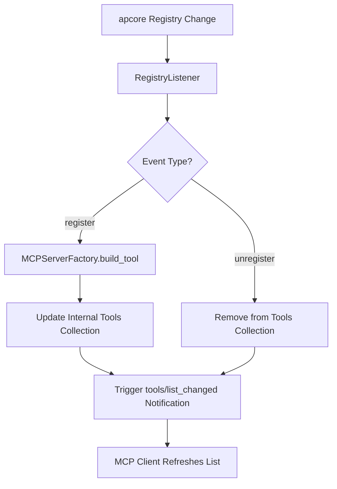

# Registry Listener

> Feature spec for code-forge implementation planning.
> Source: extracted from apcore-mcp/docs/tech-design-apcore-mcp.md
> Created: 2026-04-06

## Purpose

The Registry Listener enables "hot reloading" of MCP tools by monitoring an apcore Registry for runtime changes. When modules are added, removed, or updated in the underlying registry, the listener ensures that the MCP server's tool list is automatically synchronized and that connected clients are notified of the change.

## Scope

**Included:**
- Monitoring `register` and `unregister` events from an apcore Registry.
- Dynamic addition/removal of tools from the active MCP tool list.
- Sending `notifications/tools/list_changed` to connected MCP clients.
- Thread-safe management of the internal tool list.
- Throttling and debouncing of rapid registration events.

**Excluded:**
- Implementation of the Registry (provided by the apcore SDK).
- Modification of existing tool logic (only handles the list of available tools).

## Core Responsibilities

1. **Event Monitor** — Subscribes to the event system of an apcore Registry to receive notifications when modules are added or removed.
2. **Tool Sync** — Automatically rebuilds the specific tool entry (using the `MCPServerFactory`) when a module is registered and updates the server's internal collection.
3. **Client Notifier** — Triggers the protocol-specific notification (`notifications/tools/list_changed`) that informs MCP clients (like Claude Desktop) to refresh their tool list.
4. **Safety Lock** — Uses synchronization primitives (e.g., `asyncio.Lock`) to ensure the tool list remains consistent during concurrent updates and client requests.

## Interfaces

### Inputs
- **Registry Events** (apcore SDK) — `on_register` and `on_unregister` callbacks from the source Registry.

### Outputs
- **Tool List Notification** (MCP SDK) — A protocol notification broadcast to all connected clients.
- **Updated Tool Collection** (MCPServerFactory) — The modified set of tools used for discovery requests.

### Dependencies
- **apcore-python SDK** — Provides the Registry and its event system.
- **MCP Python SDK** — Provides the server-side notification API.

## Data Flow

## Key Behaviors

### Dynamic Synchronization
The listener ensures that modules added via dynamic discovery (e.g., a new file appearing in an extensions directory) are instantly reflected as tools in the AI agent's interface without restarting the server.

### Tool List Atomicity
All updates to the internal tool dictionary are performed as an atomic operation. This prevents race conditions where a client might see a partial or inconsistent tool list during a discovery request.

### Notification Debouncing
To avoid "notification storms" during bulk registration (e.g., at startup or when loading a complex plugin), the listener can debounce `list_changed` notifications, sending only one message after a short quiet period.

## Constraints

- **Registry Compatibility**: Requires an apcore Registry that supports event listeners (standard in apcore-python >= 0.15.0).
- **Client Support**: Not all MCP clients may implement the `list_changed` notification; the listener remains functional even if clients ignore the message.
- **Async Safety**: Callbacks from the Registry (which may be synchronous) must be safely bridged to the server's asynchronous event loop.

## Error Handling

- **Sync Failure**: If building a tool for a new module fails, the listener logs the error and does NOT update the tool list or notify the client, preserving the server's stability.
- **Listener Leak**: The listener must be properly detached when the server shuts down to prevent memory leaks.

## Notes

- This feature is critical for developer productivity, allowing for live-coding of modules that are immediately usable in the agent UI.
- It enables advanced use cases like server-side "plugin stores" or dynamic capability discovery.
