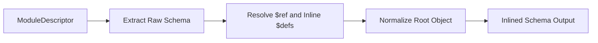

# Schema Converter

> Feature spec for code-forge implementation planning.
> Source: extracted from apcore-mcp/docs/tech-design-apcore-mcp.md
> Created: 2026-04-06

## Purpose

The Schema Converter is responsible for transforming apcore JSON Schema definitions (produced by Pydantic) into clean, compatible schemas suitable for MCP `inputSchema` and OpenAI `parameters`. It ensures that all internal references are resolved and that the resulting schema follows the strict requirements of AI tool-use protocols.

## Scope

**Included:**
- Conversion of `input_schema` and `output_schema` from apcore `ModuleDescriptor`.
- Inlining of `$defs` and `$ref` references to create self-contained schemas.
- Guaranteeing that root-level schemas have `type: object`.
- Validation and cycle detection during reference resolution.
- Support for all standard JSON Schema types.

**Excluded:**
- External file reference resolution (only handles local `$defs` references).
- Domain-specific schema validation beyond the protocol requirements.
- Modification of original `ModuleDescriptor` data.

## Core Responsibilities

1. **Reference Inlining** — Recursively resolves and replaces `$ref` nodes with their actual definitions from `$defs` or `definitions`.
2. **Root Normalization** — Ensures every tool input schema has a clear `type: object` and properties mapping, even if the source is empty.
3. **Cycle Detection** — Prevents infinite recursion by tracking visited reference paths and enforcing a maximum recursion depth (32 levels).
4. **Clean-up** — Removes `$defs` and `definitions` keys from the final schema after successful inlining.

## Interfaces

### Inputs
- **ModuleDescriptor** (apcore Registry) — Contains the raw `input_schema` and `output_schema` dicts.

### Outputs
- **JSON Schema Dict** (MCP/OpenAI Converters) — A self-contained, inlined schema dictionary.

### Dependencies
- **apcore-python SDK** — Provides the `ModuleDescriptor` structure and raw schema data.

## Data Flow

## Key Behaviors

### $ref Inlining Algorithm
The converter walks the schema tree recursively. When it encounters a `{"$ref": "#/$defs/Name"}` node, it looks up "Name" in the schema's `$defs` section, deep-copies the definition, recursively resolves any nested refs within that copy, and replaces the `$ref` node with the resolved result.

### Root Object Guarantee
If a schema is empty (`{}`), it is normalized to `{"type": "object", "properties": {}}`. If it lacks a `type` but has `properties`, `type: object` is added.

### Output Schema Handling
`output_schema` is converted for use in structured tool results. Unlike `input_schema`, an empty `output_schema` results in an empty dict `{}` as no input parameters are expected.

## Constraints

- **Recursion Limit**: Maximum of 32 levels of nesting to prevent stack overflow.
- **Bijective Resolution**: Local references must exist in the schema's own `$defs` section.
- **Immutability**: The converter must operate on copies and never mutate the source `ModuleDescriptor` data.

## Error Handling

- **Circular Reference**: Raises `ValueError` with the path of the cycle (e.g., "Circular reference: A -> B -> A").
- **Missing Definition**: Raises `KeyError` if a `$ref` points to a missing key in `$defs`.
- **Max Depth Exceeded**: Raises `ValueError` if the 32-level recursion limit is reached.

## Notes

- This component is critical for compatibility with MCP clients (like Claude Desktop) and OpenAI's API, which often struggle with unresolved JSON Schema references.
- It reuses patterns from apcore's internal `RefResolver` but is optimized for the specific constraints of tool-use protocols.
