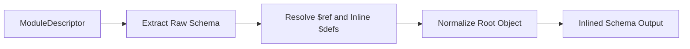

# Schema Converter

> Feature spec for code-forge implementation planning.
> Source: extracted from apcore-mcp/docs/tech-design-apcore-mcp.md
> Created: 2026-04-06

## Purpose

The Schema Converter is responsible for transforming apcore JSON Schema definitions (produced by Pydantic) into clean, compatible schemas suitable for MCP `inputSchema` and OpenAI `parameters`. It ensures that all internal references are resolved and that the resulting schema follows the strict requirements of AI tool-use protocols.

## Scope

**Included:**
- Conversion of `input_schema` and `output_schema` from apcore `ModuleDescriptor`.
- Inlining of `$defs` and `$ref` references to create self-contained schemas.
- Guaranteeing that root-level schemas have `type: object`.
- Validation and cycle detection during reference resolution.
- Support for all standard JSON Schema types.

**Excluded:**
- External file reference resolution (only handles local `$defs` references).
- Domain-specific schema validation beyond the protocol requirements.
- Modification of original `ModuleDescriptor` data.

## Core Responsibilities

1. **Reference Inlining** — Recursively resolves and replaces `$ref` nodes with their actual definitions from `$defs` or `definitions`.
2. **Root Normalization** — Ensures every tool input schema has a clear `type: object` and properties mapping, even if the source is empty.
3. **Cycle Detection** — Prevents infinite recursion by tracking visited reference paths and enforcing a maximum recursion depth (32 levels).
4. **Clean-up** — Removes `$defs` and `definitions` keys from the final schema after successful inlining.

## Interfaces

### Inputs
- **ModuleDescriptor** (apcore Registry) — Contains the raw `input_schema` and `output_schema` dicts.

### Outputs
- **JSON Schema Dict** (MCP/OpenAI Converters) — A self-contained, inlined schema dictionary.

### Dependencies
- **apcore SDK (language-equivalent: apcore-python / apcore-js / apcore Rust crate)** — Provides the `ModuleDescriptor` structure and raw schema data.

## Data Flow

```mermaid
graph LR
    A[ModuleDescriptor] --> B[Extract Raw Schema]
    B --> C[Resolve $ref and Inline $defs]
    C --> D[Normalize Root Object]
    D --> E[Inlined Schema Output]
```

## Key Behaviors

### $ref Inlining Algorithm
The converter walks the schema tree recursively. When it encounters a `{"$ref": "#/$defs/Name", ...}` node, it looks up "Name" in the schema's `$defs` section, deep-copies the definition, recursively resolves any nested refs within that copy, then **shallow-merges the node's sibling keys (every key beside `$ref`) over the resolved result, sibling winning on conflict**, and replaces the `$ref` node with the merged result.

### $ref Sibling Keys Are Preserved
A key written beside `$ref` (e.g. `{"$ref": "#/$defs/Token", "x-sensitive": true}`) MUST survive resolution — it is not discarded when the `$ref` branch is taken. This is a security requirement, not a fidelity nicety: the router's output redaction (see `output_redaction.json`) reads `x-sensitive` off the *resolved* output schema to decide what to mask, so a field marked sensitive behind a `$ref` would otherwise reach the redactor with nothing to redact on and leak in plaintext. The rule:

- Resolve the `$ref` target, recursively inlining any refs within it.
- Merge the node's own sibling keys **over** the resolved target (shallow merge at that node; siblings that are themselves subschemas are independently walked for nested `$ref`s).
- On a key present in both, the **sibling wins** — it is the caller's explicit, more specific value; the `$defs` entry is the default.
- A chained `$ref` (one `$defs` entry pointing at another) carries siblings contributed at each hop, with the outermost sibling winning on conflict.
- This does **not** change error behavior: a `$ref` naming a definition absent from `$defs` still raises (`KeyError` / `Definition not found`); sibling merging only applies once a reference resolves.

This mirrors the identical fix landed in apcore 0.31.0 (decision D-98/D-124) and apcore-toolkit 0.12.0's `deep_resolve_refs` — this converter is an independent implementation with no shared code path, so it carried the same latent defect and needed the same fix applied separately. Conformance: [`schema_converter.json`](../../conformance/fixtures/schema_converter.json).

### Root Object Guarantee
If a schema is empty (`{}`), it is normalized to `{"type": "object", "properties": {}}`. If it lacks a `type` but has `properties`, `type: object` is added.

### Output Schema Handling
`output_schema` is converted for use in structured tool results. Unlike `input_schema`, an empty `output_schema` results in an empty dict `{}` as no input parameters are expected.

## Constraints

- **Recursion Limit**: Maximum of 32 levels of nesting to prevent stack overflow.
- **Bijective Resolution**: Local references must exist in the schema's own `$defs` section.
- **Immutability**: The converter must operate on copies and never mutate the source `ModuleDescriptor` data.

## Error Handling

- **Circular Reference**: Raises `ValueError` with the path of the cycle (e.g., "Circular reference: A -> B -> A").
- **Missing Definition**: Raises `KeyError` if a `$ref` points to a missing key in `$defs`.
- **Max Depth Exceeded**: Raises `ValueError` if the 32-level recursion limit is reached.

## Strict Mode for MCP

The Schema Converter exposes a `strict` option that tightens the converted JSON Schema for MCP clients without breaking MCP's permissive posture.

### Per-SDK Defaults
- Python (`SchemaConverter(strict=True)`) — default `True`.
- TypeScript (`convertInputSchema(descriptor, { strict })`) — option is optional and defaults to **`true`** at the converter level (`schema.ts:77`, the [SC-11] alignment fix); callers that want permissive schemas must pass `{ strict: false }` explicitly. An earlier revision of this spec said the default was `false`; it is not.
- Rust (`SchemaConverter::convert_input_schema_strict(schema, strict)`) — strict is an explicit parameter; the default constructor path uses strict mode, and the factory invokes the strict variant.

### What Strict Injects
When enabled, strict recursively walks the schema and sets `additionalProperties: false` on every JSON Schema node that is one of:
- `type == "object"`,
- a `type` array containing `"object"`,
- or a schema that declares `properties` without an explicit `type`.

### What Strict Does NOT Do
Unlike apcore's core `to_strict_schema`, the MCP-side strict mode does **not** force every property to be `required` and does **not** rewrite optional fields to be `nullable`. This preserves MCP's permissive posture (optional fields stay optional, absent fields stay absent) while still blocking unknown keys.

### Preservation Rules
User-set `additionalProperties` values (whether `true`, `false`, or a subschema) are always preserved — strict mode never overwrites an existing declaration. Injection only occurs when the key is absent.

### Implementation References
- Python: `src/apcore_mcp/adapters/schema.py` (`_inject_additional_properties_false`).
- TypeScript: `src/adapters/schema.ts` (`ConvertSchemaOptions.strict`).
- Rust: `src/adapters/schema.rs` (`inject_strict`).

## Notes

- This component is critical for compatibility with MCP clients (like Claude Desktop) and OpenAI's API, which often struggle with unresolved JSON Schema references.
- It reuses patterns from apcore's internal `RefResolver` but is optimized for the specific constraints of tool-use protocols.

---

## Contract: SchemaConverter.convert_input_schema

### Inputs
- descriptor: Any, required (duck-typed) — must have `input_schema` attribute containing a dict; NOT a raw schema dict or JSON Value

### Errors
- ValueError — when a circular `$ref` is detected (e.g., "Circular $ref detected: #/$defs/A")
- ValueError — when the 32-level recursion depth limit is exceeded
- KeyError — when a `$ref` points to a missing key in `$defs`

### Returns
- On success: dict[str, Any] — self-contained, inlined JSON Schema; all `$ref` nodes replaced; `$defs` removed from output; root always has `type: "object"`
- A key written beside `$ref` survives resolution, merged over the resolved definition, sibling winning on conflict — see [$ref Sibling Keys Are Preserved](#ref-sibling-keys-are-preserved)
- Empty schema `{}` → `{"type": "object", "properties": {}, "additionalProperties": false}` (when strict=True)
- Schema with properties but no type → `type: "object"` added
- Deep copy of source — never mutates the original descriptor
- When `strict=True` (default): `additionalProperties: false` injected on every object-typed node that lacks it; existing user-set values preserved

### Properties
- async: false
- thread_safe: true
- pure: true
- idempotent: true

---

## Contract: SchemaConverter._inject_strict

### Inputs
- node: Any, required — JSON Schema node (dict, list, or primitive); non-dict values are no-ops

### Errors
- No exceptions raised

### Returns
- On success: None — in-place mutation: sets `additionalProperties: false` on every object-typed subschema that doesn't already define the key
- Canonical subschema-keyword recursion set (all three SDKs MUST walk all of these): `items`, `additionalProperties`, `not`, `if`, `then`, `else`, `contains`, `propertyNames`, `oneOf`, `anyOf`, `allOf`, `prefixItems`, `properties`, `patternProperties`, `$defs`, `definitions`
- User-set `additionalProperties` values (true, false, or subschema dict) are always preserved — injection only when key is absent
- Object detection: `type == "object"` OR `type` array contains `"object"` OR has `properties` without conflicting non-object scalar type

### Properties
- async: false
- thread_safe: true
- pure: false
- idempotent: true
