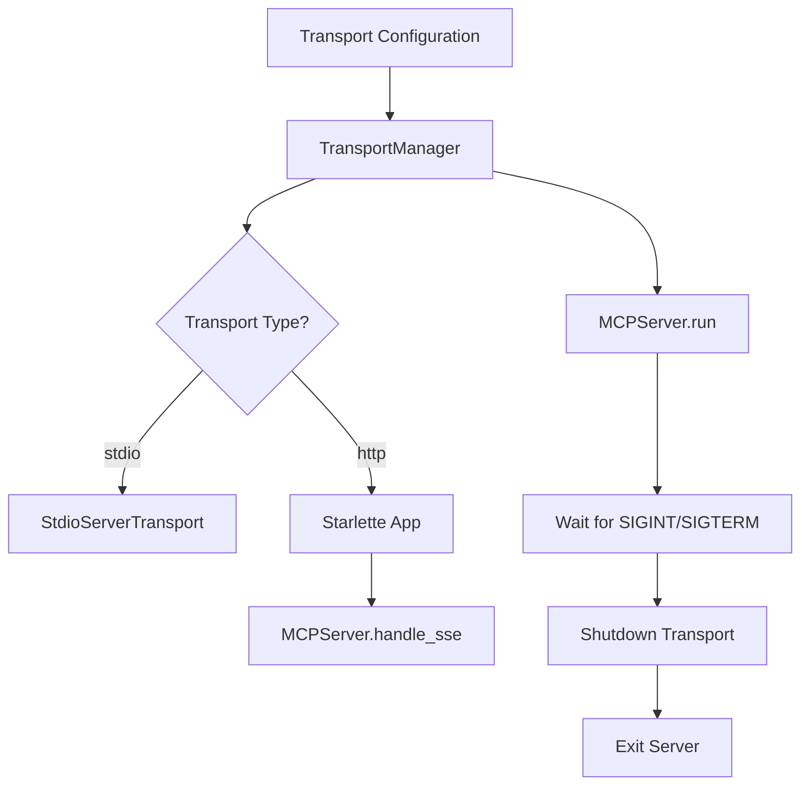

# Transport Manager

> Feature spec for code-forge implementation planning.
> Source: extracted from apcore-mcp/docs/tech-design-apcore-mcp.md
> Created: 2026-04-06

## Purpose

The Transport Manager handles the configuration and execution of the communication layer between the MCP client and the apcore-mcp server. It abstracts the differences between standard input/output (stdio), local network (SSE/HTTP), and cloud-hosted transports, allowing the same MCP logic to run in any environment.

## Scope

**Included:**
- Setup and execution of `stdio` transport (stdin/stdout).
- Setup and execution of `streamable-http` transport (Starlette/FastAPI-based).
- Support for deprecated `SSE` (Server-Sent Events) transport for backward compatibility.
- Configuration of host, port, and network bind addresses.
- Management of server lifecycle (startup, blocking wait, graceful shutdown).
- Routing of transport events (e.g., connection lost) to the server.

**Excluded:**
- Implementation of the protocol messages (handled by MCP SDK).
- Encryption or SSL termination (typically handled by a reverse proxy or the host application).

## Core Responsibilities

1. **Transport Factory** — Creates the appropriate transport instance (stdio, HTTP, SSE) based on user configuration.
2. **Server Lifecycle** — Provides a high-level `run()` method that starts the server, binds it to the transport, and blocks until shutdown signals are received.
3. **Graceful Shutdown** — Handles SIGINT and SIGTERM signals to ensure the server shuts down and closes connections cleanly without data loss or leaking processes.
4. **Environment Bridge** — Normalizes differences between synchronous stdio (process-bound) and asynchronous HTTP (network-bound) environments.

## Interfaces

### Inputs
- **Transport Type** (CLI/Public API) — Choice of `stdio`, `streamable-http`, or `sse`.
- **Host/Port** (Public API) — Bind configuration for network transports.
- **MCP Server Instance** (MCPServerFactory) — The configured logic instance to bind to.

### Outputs
- **Transport Instance** (MCP SDK) — The low-level transport object used by the MCP SDK.
- **Server Process** (OS) — The running server listening for client messages.

### Dependencies
- **MCP Python SDK** — Provides the `StdioServerTransport` and `HttpServerTransport` base classes.
- **Starlette / Uvicorn** — Used for hosting HTTP and SSE transports.

## Data Flow

## Key Behaviors

### stdio (Process-Bound)
The transport manager configures the server to read from `sys.stdin` and write to `sys.stdout`. It monitors the stdin pipe and initiates shutdown if the parent process (the MCP client) closes the pipe or terminates.

### Streamable HTTP (Network-Bound)
The transport manager constructs a Starlette ASGI application that hosts the MCP protocol. It mounts the necessary routes (e.g., `/sse`, `/messages`) and manages the Uvicorn event loop to handle concurrent client connections.

### SIGINT/SIGTERM Handling
The manager installs signal handlers that trigger an internal shutdown event. This ensures that even in a blocking `run()` call, the server can exit gracefully when a Ctrl+C or a container stop signal is received.

## Constraints

- **Port Conflict**: Must handle and report "Address already in use" errors gracefully.
- **stdio Restrictions**: While using stdio, the manager must prevent any other library (like `logging` or print statements) from writing to `stdout`, as this would corrupt the MCP protocol stream.
- **Python Version**: Network transports require an async-capable Python environment (Python 3.11+).

## Error Handling

- **Bind Failure**: Raises `OSError` if the requested port cannot be bound.
- **Transport Error**: Catches and logs transport-level errors (e.g., malformed HTTP headers) without crashing the server process.

## Notes

- `streamable-http` is the modern, recommended network transport, replacing the legacy `sse` transport.
- For embedded use (e.g., within a larger FastAPI app), the manager yields an ASGI app rather than running its own Uvicorn instance.
