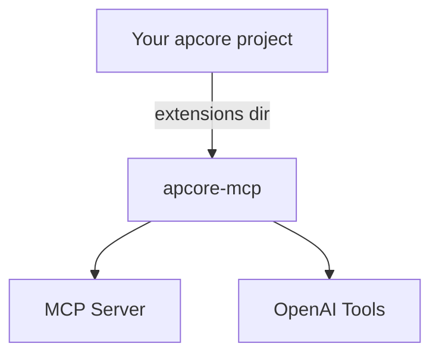

# apcore-mcp

Automatic MCP Server & OpenAI Tools Bridge for apcore.

**apcore-mcp** turns any [apcore](https://github.com/aiperceivable/apcore)-based project into an MCP Server and OpenAI tool provider — with **zero code changes** to your existing project.

## Why apcore-mcp?

If you have already built modules using the `apcore` framework (which focuses on logic, schemas, and ACL), you shouldn't have to rewrite them to support different AI interface protocols.

- **Zero intrusion** — your apcore project needs no code changes, no imports, no dependencies on apcore-mcp.
- **Zero configuration** — point to an extensions directory, everything is auto-discovered.
- **Pure adapter** — apcore-mcp reads from the apcore Registry; it never modifies your modules.
- **Works with any `xxx-apcore` project** — if it uses the apcore Module Registry, apcore-mcp can serve it.

## Implementations

| Language | Repository | Package | Status |
|----------|-----------|---------|--------|
| **Python** | [apcore-mcp-python](https://github.com/aiperceivable/apcore-mcp-python) | `pip install apcore-mcp` |  ✅  |
| **TypeScript** | [apcore-mcp-typescript](https://github.com/aiperceivable/apcore-mcp-typescript) | `npm install apcore-mcp` |  ✅  |
| **Go** | apcore-mcp-go | — | Planned |

## Core Features

- **Auto-discovery** — all modules in the extensions directory are found and exposed automatically.
- **Three transports** — stdio (default, for desktop clients), Streamable HTTP, and SSE.
- **Annotation mapping** — apcore annotations (readonly, destructive, idempotent) map to MCP ToolHints.
- **Schema conversion** — JSON Schema `$ref`/`$defs` inlining, strict mode for OpenAI Structured Outputs.
- **Tool Explorer** — Built-in browser UI for exploring and testing MCP tools (like Swagger UI for MCP).
- **JWT Authentication** — Optional Bearer token auth for HTTP-based transports.
- **Approval Mechanism** — Bridges MCP elicitation to apcore's runtime approval system.

Next: [Getting Started](getting-started.md)
